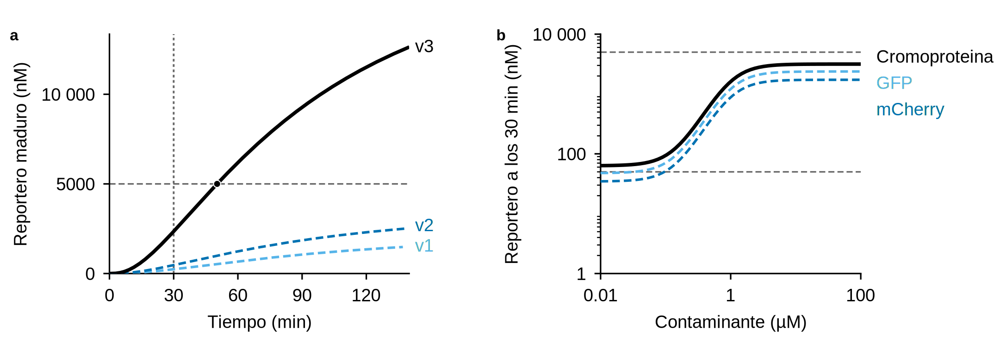
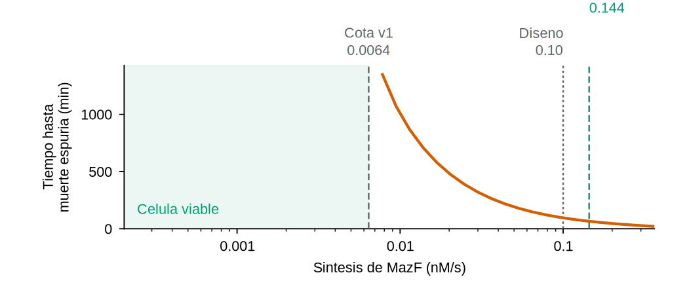
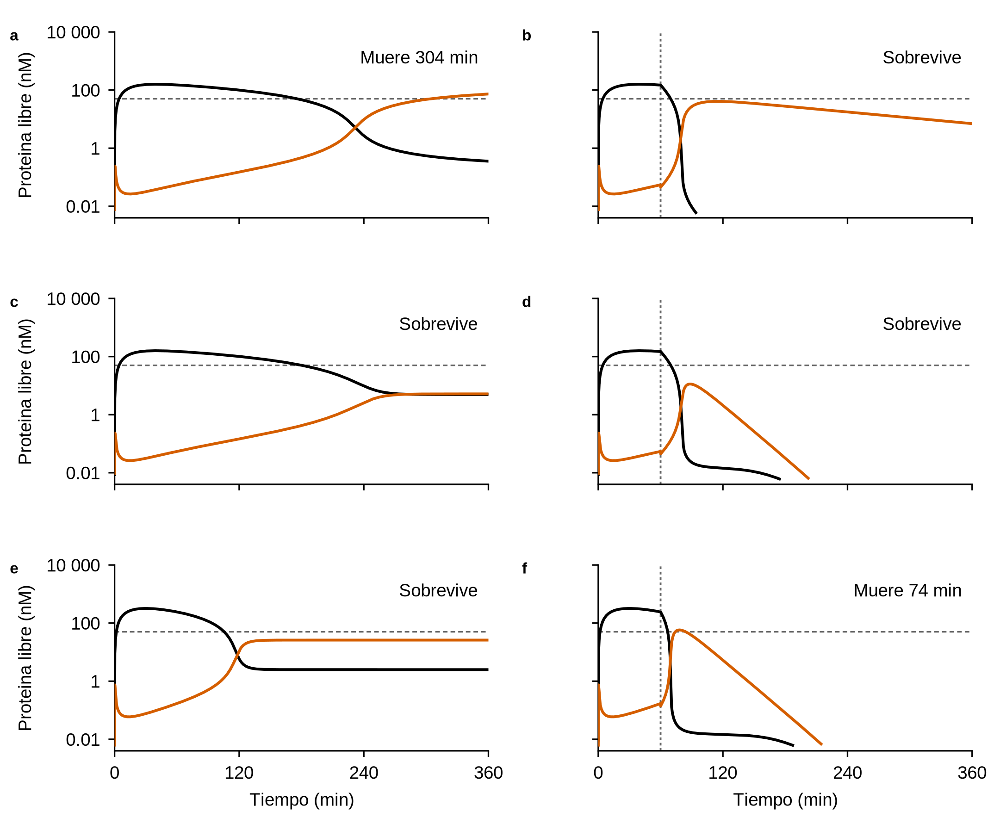
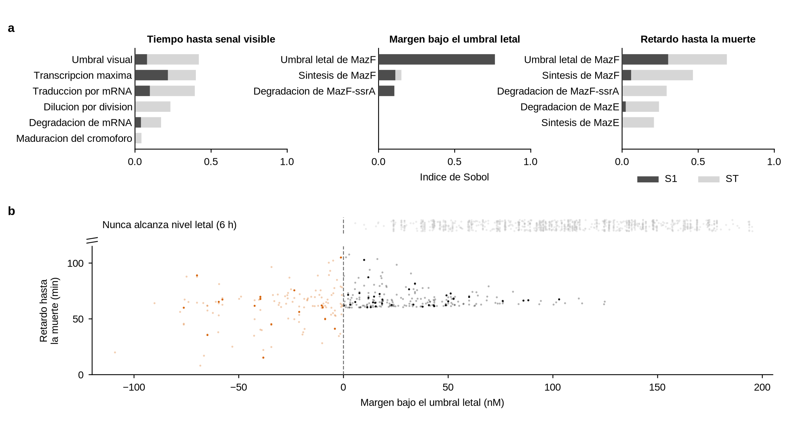

# Modelo cinético

Modelos de ODEs que responden tres preguntas que el diseño de secuencia por sí
solo no puede contestar.

> **Los parámetros no son mediciones de este proyecto.** Son valores de
> literatura para sistemas análogos en *E. coli* / *B. subtilis*, elegidos para
> obtener **órdenes de magnitud**, no predicciones cuantitativas. Cada uno está
> en `PARAMS` con su unidad y su justificación. Las conclusiones que siguen son
> robustas al valor exacto; lo que importa es la **estructura** del sistema.

```bash
# 1. paneles sueltos a SVG, uno por generador
.venv/bin/python model/fig1_sensor.py
.venv/bin/python model/fig2_killswitch.py
.venv/bin/python model/fig3_sensitivity.py --fast
.venv/bin/python model/figS_supplementary.py --fast

# 2. componer en mm, validar fuentes y exportar a main/ y supplementary/
.venv/bin/python model/compose_figures.py

# tablas del texto; no dibujan
.venv/bin/python model/run_analysis.py
.venv/bin/python model/sensitivity.py --fast
```
.venv/bin/python model/run_analysis.py
```bash
# 1. paneles sueltos a SVG, uno por generador
.venv/bin/python model/fig1_sensor.py
.venv/bin/python model/fig2_killswitch.py
.venv/bin/python model/fig3_sensitivity.py --fast
.venv/bin/python model/figS_supplementary.py --fast

# 2. componer en mm, validar fuentes y exportar a main/ y supplementary/
.venv/bin/python model/compose_figures.py

# tablas del texto; no dibujan
.venv/bin/python model/run_analysis.py
.venv/bin/python model/sensitivity.py --fast
```

---

## 1. ¿Es alcanzable el "<30 minutos"?

**No para lectura a simple vista, ni siquiera en la v2.** Ningún reportero
cruza el umbral visual dentro de 30 min:

| Versión | A simple vista | Con instrumento |
|---|---|---|
| v1 (GFP, sin espaciador, B0032) | **no alcanza** | 14 min |
| v2 (eforRed, espaciador, B0032) | **no alcanza** | 10 min |
| **v3 (eforRed, espaciador, RBS *B. subtilis*)** | **50 min** | **5 min** |

**La v2 seguía sin funcionar en *B. subtilis*.** Corrigió el espaciador pero
conservó BBa_B0032, cuyo Shine-Dalgarno solo aparea 4 nt con el 16S de *B.
subtilis*. Solo la v3 da señal visible — y aun así, por encima de los 30 min.



*Fig. 1a — curso temporal por versión.*

El cuello de botella no es la transcripción ni la traducción: es la
**maduración del cromóforo**, que impone un piso de 20–45 min según el
reportero. Ninguna optimización del promotor o del RBS lo evita.

La cromoproteína **sí era la elección correcta** —es la más rápida y no
necesita excitación— pero no basta para sostener el "<30 min". Las opciones
honestas son:

- ajustar la afirmación a **~45 minutos** para lectura visual, o
- mantener los 30 min y declarar que requiere lector.

*Fig. 1b (arriba) — dosis-respuesta a los 30 min.*

A los 30 min la respuesta ya es sigmoidea y discrimina dosis, pero se queda por
debajo del umbral visual en todo el rango: **hay señal medible antes de que
haya señal visible.**

## 2. El Shine-Dalgarno, no solo el espaciado

El espaciado RBS→ATG era solo la mitad del problema. La otra mitad es que **los
RBS del registro iGEM están caracterizados en *E. coli***, y el 16S de *B.
subtilis* exige un SD más largo y contiguo.

| RBS | Apareamiento SD | Eficiencia |
|---|---|---|
| BBa_B0032 (v1, v2) | 4 nt (`AGGA`) | 15 % |
| BBa_B0034 (v1, v2) | 5 nt (`AGGAG`) | 40 % |
| Bsub medium (v3) | 6 nt (`AGGAGG`) | 75 % |
| **Bsub strong (v3)** | **7 nt (`AGGAGGT`)** | **100 %** |

| SD | Tiempo hasta señal |
|---|---|
| 4 nt | no alcanza |
| 5 nt | 91 min |
| 6 nt | 50 min |
| 7 nt | 41 min |

La síntesis compite con la dilución por división. Por debajo de cierto umbral
la proteína madura se estabiliza en una meseta bajo el nivel detectable, y
esperar más no ayuda: el defecto no retrasa el sensor, **lo inutiliza**.

`scripts/validate_assembly.py` mide este apareamiento y falla por debajo de
5 nt, así que el criterio queda verificado y no supuesto.

## 3. ¿El kill switch contiene la célula?

**En v1 no, por una razón estructural. En v2 sí.** El hallazgo más importante
del modelo, y el que motivó la corrección.

### La cota de viabilidad

Secuestrar la toxina en el complejo MazE–MazF **no la elimina**: ClpAP degrada
la MazE del complejo y libera la MazF intacta, que es estable (t½ ≈ 90 min
frente a 10 min de MazE). El único sumidero real de toxina es su propia
degradación. En estado estacionario:

$$k_F < d_F \cdot F_{letal}$$

| | cota admisible | k_mazF del diseño | |
|---|---|---|---|
| **v1** (MazF sin tag) | 0.0064 nM/s | 0.1 nM/s | **16× por encima** |
| **v2** (MazF-ssrA) | 0.1444 nM/s | 0.1 nM/s | dentro de la cota |

La corrección no toca promotores ni RBS: el tag **ssrA** (AANDENYALAA) en el
C-terminal de MazF la hace sustrato de ClpXP, bajando su t½ de ~90 a ~4 min.
Eso sube `d_mazF` y con ello la cota **22×**, sin alterar la lógica del
circuito.

**Aumentar la síntesis de antitoxina no relaja esta cota** — solo retrasa el
momento en que se alcanza. Es una propiedad del sistema, no un parámetro a
afinar.



*Fig. S3 — la cota analítica de viabilidad y cuánto la desplaza el tag ssrA.*

### Consecuencia: el switch dispara solo

| Escenario | v1 | v2 | v3 | Debería |
|---|---|---|---|---|
| Plásmido retenido | muere 304 min ✗ | sobrevive ✓ | **sobrevive** ✓ | sobrevivir |
| Plásmido perdido | **sobrevive** ✗ | **sobrevive** ✗ | **muere 74 min** ✓ | morir |

**La v2 tampoco contenía.** Con SD de 4–5 nt la toxina nunca alcanza
concentración letal, así que la célula sobrevive al escape. La contención
parecía resuelta solo porque el modelo anterior asumía traducción plena — un
supuesto que el chasis no cumple.



**Solo la v3 discrimina correctamente.**

### Los márgenes de la v3 son estrechos

Conviene declararlo en vez de presentar la corrección como resuelta:

- En reposo, MazF libre se estabiliza en **26 nM contra un umbral de 50 nM**.
- Tras perder el plásmido, la **ventana letal es de solo 10 min**. Si la muerte
  no ocurre dentro de ella, la célula se recupera.

Ambos márgenes dependen de parámetros no medidos. Una corrección más robusta
sería **hacer la toxina condicional** en vez de constitutiva: que MazF solo se
exprese ante la señal de escape, eliminando la carrera permanente entre
síntesis y degradación. Eso es un rediseño, no un ajuste.

---

## 4. ¿Cuánto de esto depende de los parámetros elegidos?

Análisis de sensibilidad global (Sobol) sobre 13 parámetros, cada uno muestreado
en un rango que refleja su incertidumbre real — factor 2 para vidas medias bien
acotadas, factor 4 para los umbrales de detección y letalidad, que son
estimaciones gruesas.

```bash
# 1. paneles sueltos a SVG, uno por generador
.venv/bin/python model/fig1_sensor.py
.venv/bin/python model/fig2_killswitch.py
.venv/bin/python model/fig3_sensitivity.py --fast
.venv/bin/python model/figS_supplementary.py --fast

# 2. componer en mm, validar fuentes y exportar a main/ y supplementary/
.venv/bin/python model/compose_figures.py

# tablas del texto; no dibujan
.venv/bin/python model/run_analysis.py
.venv/bin/python model/sensitivity.py --fast
```
.venv/bin/python model/sensitivity.py --fast   # ~2 min, suficiente para las conclusiones
.venv/bin/python model/sensitivity.py          # ~15 min, cifras del texto
```bash
# 1. paneles sueltos a SVG, uno por generador
.venv/bin/python model/fig1_sensor.py
.venv/bin/python model/fig2_killswitch.py
.venv/bin/python model/fig3_sensitivity.py --fast
.venv/bin/python model/figS_supplementary.py --fast

# 2. componer en mm, validar fuentes y exportar a main/ y supplementary/
.venv/bin/python model/compose_figures.py

# tablas del texto; no dibujan
.venv/bin/python model/run_analysis.py
.venv/bin/python model/sensitivity.py --fast
```



*Fig. 3a — índices de Sobol por conclusión.*

Los índices: **S1** es la varianza que un parámetro explica por sí solo, **ST**
incluye sus interacciones. `ST >> S1` significa que el parámetro importa sobre
todo por cómo se combina con otros.

### Qué gobierna cada conclusión

**Tiempo hasta señal:** lo dominan `k_txn_max` (fuerza del promotor), `k_tln`
(traducción) y `thr_visual` (umbral visual). Ninguno está medido en este
sistema. Notablemente, `t_mat_chromo` —la maduración, que el análisis anterior
presentaba como el cuello de botella— tiene ST ≈ 0.04: **es casi irrelevante**
frente a la incertidumbre de los demás.

**Margen del kill switch:** `tox_lethal` explica el 79 % de la varianza él solo.
Es decir, la conclusión depende casi por completo de **cuánta MazF libre mata
realmente a la célula** — un número que estimé, no que medí.

**Retardo hasta la muerte:** aquí casi todo es interacción. `k_mazF`, `d_mazF_ssrA`,
`k_mazE` y `d_mazE` tienen ST mucho mayor que S1: ningún parámetro manda solo,
mandan las razones entre ellos.

### El hallazgo: seguridad y contención compiten por el mismo parámetro

*Fig. 3b–c (arriba) — la tensión entre las dos condiciones.*

Un kill switch debe cumplir dos cosas a la vez: **no matar** con el plásmido y
**matar** al perderlo. Muestreando el espacio de parámetros, solo una de cada
cuatro combinaciones lo consigue:

| | fracción |
|---|---|
| **cumple ambas** | **25.9 %** |
| seguro pero no contiene | 60.1 % |
| contiene pero dispara solo | 14.1 % |
| ninguna | 0.0 % |

Y el contraste es directo: entre las que **sí matan**, el margen mediano en
reposo es de **32 nM**; entre las que **no**, de **108 nM**.

**El modo de fallo dominante no es el disparo espurio, sino la falta de
muerte.** Seis de cada diez combinaciones producen una célula perfectamente
segura que nunca muere al escapar. Y la razón es directa: un margen amplio en
reposo significa que la toxina está lejos del nivel letal, que es exactamente
lo que impide que lo alcance tras perder el plásmido.

Con promotores constitutivos, **seguridad y contención se regulan con el mismo
parámetro y en sentidos opuestos**. No es un problema de calibración que se
resuelva afinando `k_mazF`: es la arquitectura. La solución es hacer la toxina
**condicional** —expresada solo ante la señal de escape— de modo que los dos
regímenes queden separados por una entrada, no por un valor.

> Nota metodológica: la correlación aparente entre margen y retardo (+0.70) es
> **artefacto de censurar el retardo a 6 h**. Entre las muestras que sí matan,
> la correlación real es +0.19. El hallazgo se sostiene por las fracciones de
> la tabla y por el contraste de márgenes, no por esa correlación.
>
> Cifras de la corrida completa (n=1024, 15.360 evaluaciones). Con `--fast`
> (n=128) los porcentajes varían menos de un punto, así que las conclusiones
> no dependen del tamaño de muestra.

### Qué habría que medir primero

Por orden de impacto sobre las conclusiones:

1. **`tox_lethal`** — cuánta MazF libre mata. Domina dos de las tres salidas.
2. **`k_txn_max` y `k_tln`** — fuerza real de promotor y traducción en *B. subtilis*.
3. **`thr_visual`** — cuánta cromoproteína hace falta para ver color.

## Estructura

| Archivo | Qué hace |
|---|---|
| `kinetics.py` | ODEs, parámetros y la cota analítica de viabilidad |
| `run_analysis.py` | análisis determinista, tablas del texto |
| `fig1_sensor.py` | paneles de la Fig. 1 (sensor) |
| `fig2_killswitch.py` | paneles de la Fig. 2 (kill switch) |
| `fig3_sensitivity.py` | paneles de la Fig. 3 (incertidumbre) |
| `figS_supplementary.py` | paneles de las figuras S1–S4 |
| `compose_figures.py` | compone los paneles en mm y exporta |
| `figstyle.py` | estilo derivado de `figures/theme.json` |
| `sensitivity.py` | barrido de Sobol; cachea en `.cache/` |
| `.cache/` | muestras de Sobol, para no recorrer el modelo al retocar figuras |

## Figuras

Tres figuras de manuscrito, cada una con una sola afirmación y paneles de
roles inferenciales distintos:

| | Afirmación | Paneles |
|---|---|---|
| **Fig. 1** | el sensor no alcanza señal visible en 30 min | `a` curso temporal · `b` dosis-respuesta |
| **Fig. 2** | solo la v3 contiene la célula | `a`–`f` versión × destino del plásmido |
| **Fig. 3** | las conclusiones bajo incertidumbre | `a` Sobol · `b` tensión · `c` cuadrantes |

El barrido de síntesis de toxina (antes figura 04) pasó a **Extended Data
ED1**: sostiene la misma afirmación que la Fig. 2 por vía analítica, así que
no gana un panel en la figura principal.

El contrato está en `figures/theme.json` y es la única fuente de color y
tipografía:

- ancho fijo de **183 mm** (columna doble de Nature)
- paleta **Okabe-Ito**, legible con daltonismo y en escala de grises
- **dos tamaños**: 7 pt cuerpo, 8 pt etiqueta de panel
- **PDF vectorial** con texto editable, más PNG a 300 dpi

Sin títulos ni texto explicativo dentro de la imagen: eso vive en
`figures/legends.md`. Dentro solo queda lo que no se puede decir en el pie
—unidades, categorías, umbrales— y el propio tema impone un techo de 4
palabras por rótulo.

`compose_figures.py` valida cada glifo contra el mínimo de la revista y
**aborta el export** si alguno queda por debajo, en vez de escribir una figura
defectuosa.

```bash
# 1. paneles sueltos a SVG, uno por generador
.venv/bin/python model/fig1_sensor.py
.venv/bin/python model/fig2_killswitch.py
.venv/bin/python model/fig3_sensitivity.py --fast
.venv/bin/python model/figS_supplementary.py --fast

# 2. componer en mm, validar fuentes y exportar a main/ y supplementary/
.venv/bin/python model/compose_figures.py

# tablas del texto; no dibujan
.venv/bin/python model/run_analysis.py
.venv/bin/python model/sensitivity.py --fast
```
