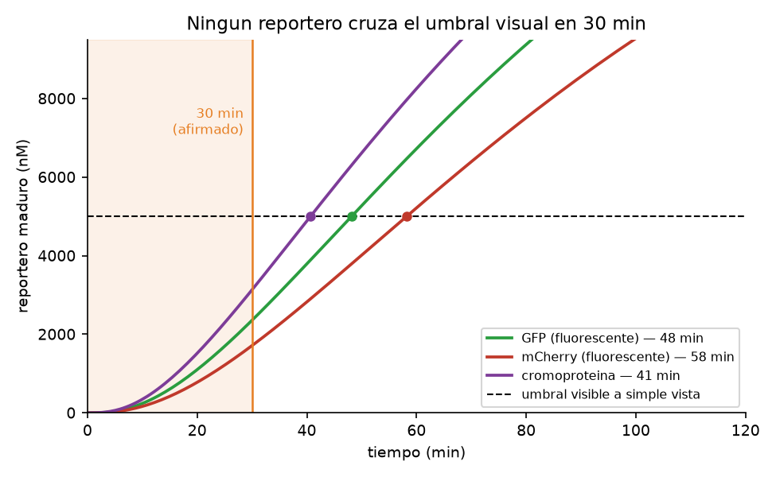
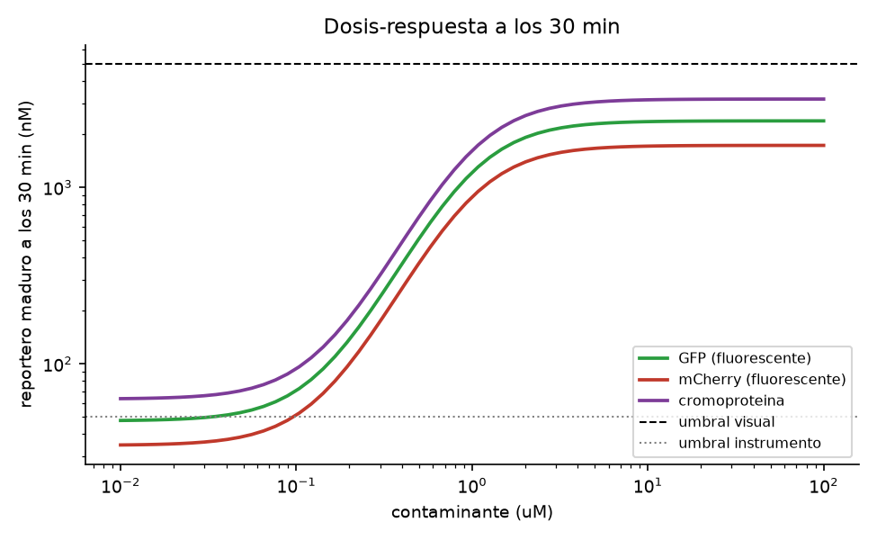
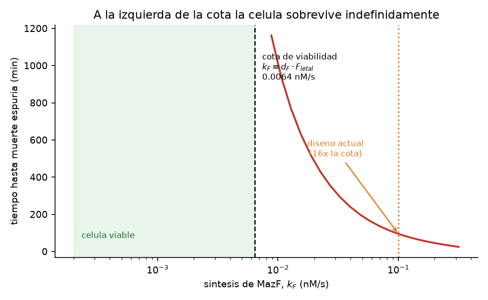
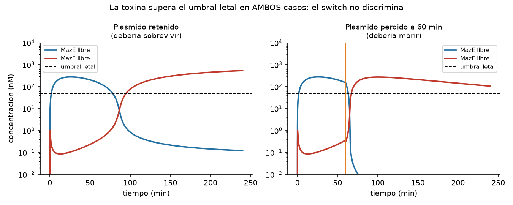

# Modelo cinético

Modelos de ODEs que responden tres preguntas que el diseño de secuencia por sí
solo no puede contestar.

> **Los parámetros no son mediciones de este proyecto.** Son valores de
> literatura para sistemas análogos en *E. coli* / *B. subtilis*, elegidos para
> obtener **órdenes de magnitud**, no predicciones cuantitativas. Cada uno está
> en `PARAMS` con su unidad y su justificación. Las conclusiones que siguen son
> robustas al valor exacto; lo que importa es la **estructura** del sistema.

```bash
.venv/bin/python model/run_analysis.py
```

---

## 1. ¿Es alcanzable el "<30 minutos"?

**No para lectura a simple vista.** Ningún reportero cruza el umbral visual
dentro de 30 min:

| Reportero | A simple vista | Con instrumento |
|---|---|---|
| GFP | 48 min | 5 min |
| mCherry | 58 min | 6 min |
| **cromoproteína** | **41 min** | **5 min** |



El cuello de botella no es la transcripción ni la traducción: es la
**maduración del cromóforo**, que impone un piso de 20–45 min según el
reportero. Ninguna optimización del promotor o del RBS lo evita.

Esto refina la limitación 1 del README principal. La cromoproteína **sí es la
elección correcta** —es la más rápida de las tres y no necesita excitación—
pero no basta para sostener el "<30 min". Las opciones honestas son:

- ajustar la afirmación a **~45 minutos** para lectura visual, o
- mantener los 30 min y declarar que requiere lector.



A los 30 min la respuesta ya es sigmoidea y discrimina dosis, pero se queda por
debajo del umbral visual en todo el rango: **hay señal medible antes de que
haya señal visible.**

## 2. ¿Cuánto cuesta el defecto de espaciado RBS→ATG?

Es peor que una simple demora. Por debajo del 20 % de eficiencia traduccional,
el sensor **nunca** alcanza el umbral visual:

| Eficiencia de traducción | Tiempo hasta señal |
|---|---|
| 100 % | 41 min |
| 50 % | 72 min |
| 20 % | no alcanza |
| **10 %** (espaciado 0 nt) | **no alcanza** |

La síntesis compite con la dilución por división celular. Por debajo de cierto
umbral la proteína madura se estabiliza en una meseta bajo el nivel detectable,
y esperar más no ayuda. El defecto no retrasa el sensor: **lo inutiliza**.

## 3. ¿El kill switch contiene la célula?

**No, y el problema es estructural.** El hallazgo más importante del modelo.

### La cota de viabilidad

Secuestrar la toxina en el complejo MazE–MazF **no la elimina**: ClpAP degrada
la MazE del complejo y libera la MazF intacta, que es estable (t½ ≈ 90 min
frente a 10 min de MazE). El único sumidero real de toxina es su propia
degradación. En estado estacionario:

$$k_F < d_F \cdot F_{letal}$$

| | valor |
|---|---|
| k_mazF admisible | 0.0064 nM/s |
| k_mazF del diseño | 0.1 nM/s |
| | **16× por encima** |

**Aumentar la síntesis de antitoxina no relaja esta cota** — solo retrasa el
momento en que se alcanza. Es una propiedad del sistema, no un parámetro a
afinar.



### Consecuencia: el switch dispara solo

| Escenario | Resultado | Debería |
|---|---|---|
| Plásmido retenido | muere a los **95 min** | sobrevivir |
| Plásmido perdido a 60 min | muere a los **67 min** | morir |



El margen entre ambos es de 28 min: **la célula muere tenga o no el plásmido.**
Un kill switch que mata al huésped que debía preservar no es contención, es
pérdida del cultivo.

Y el defecto de RBS lo empeora: con la antitoxina traducida al 10 %, la muerte
espuria se adelanta de 95 a 14 min.

| RBS mazE | Muerte espuria |
|---|---|
| 100 % | 95 min |
| 50 % | 51 min |
| 20 % | 22 min |
| 10 % | 14 min |

### Cómo corregirlo

1. **Bajar k_mazF ~16×** — promotor más débil que J23117, o RBS más débil que
   B0032 en la unidad de la toxina.
2. **Desestabilizar MazF** con un tag de degradación (ssrA), subiendo `d_mazF`
   y con ello la cota.
3. **Hacer condicional la toxina** en vez de constitutiva: que MazF solo se
   exprese ante la señal de escape, en lugar de correr siempre contra la
   antitoxina.

La opción 3 es la más robusta: elimina la carrera permanente entre síntesis y
degradación de la que depende el diseño actual.

---

## Estructura

| Archivo | Qué hace |
|---|---|
| `kinetics.py` | ODEs, parámetros y la cota analítica de viabilidad |
| `run_analysis.py` | corre el análisis, imprime la tabla y escribe las figuras |
| `figures/` | salida, regenerable — no editar a mano |

Integración con **LSODA**, que conmuta solo entre métodos stiff y no-stiff: el
sistema lo es, porque `k_on` es rápido frente a las degradaciones y `d_mazE` y
`d_mazF` difieren un orden de magnitud.

## Qué falta

- Ajustar parámetros contra datos experimentales propios
- Análisis de sensibilidad global (Sobol) para saber qué parámetros dominan
- Modelo estocástico: a bajo número de copias el ruido puede disparar el switch
- Carga metabólica del plásmido sobre el crecimiento
